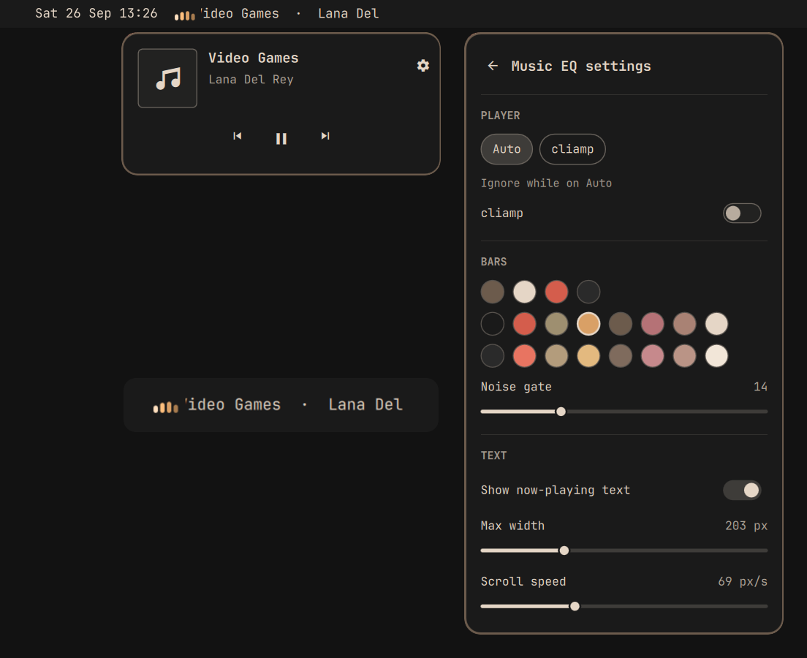

# Music EQ

A small, audio-reactive equalizer for the [Omarchy](https://omarchy.org/) bar:
4 bars driven by [cava](https://github.com/karlstav/cava), tinted in four shades
of a theme colour (accent by default), plus a scrolling now-playing text. Works with any
MPRIS player (Spotify, browsers, mpv, VLC, cliamp, …) via `playerctl`.

Left click opens a small player card with album art and previous / play-pause / next.
The gear in the card opens its settings.

<div align="center">
    
</div>

## Install

```sh
omarchy pkg add cava playerctl
omarchy plugin add https://github.com/taiku666/omarchy-music-eq.git --enable
```

Update with `omarchy plugin update io.github.taiku666.music-eq && omarchy restart shell`.
Remove with `omarchy plugin remove io.github.taiku666.music-eq`.

## Usage

| Action | Result |
|---|---|
| Hover | Tooltip with title · artist and a reminder of these mouse actions |
| Left click | Player card (art, title, artist, previous / play-pause / next, ⚙ settings) |
| Middle click | Play / pause |
| Right click | Next track |
| Scroll up / down | Previous / next track |

- Playing: bars move with the music, the title scrolls if it is longer than the label.
- Paused or nothing playing: bars rest flat and dimmed, the text is hidden so the
  widget shrinks to just the bars.

### Keybindings

The widget answers `omarchy-shell io.github.taiku666.music-eq <command>` with
`toggle`, `open`, `close`, `settings`, `playPause`, `next` and `previous`. For
example, in `~/.config/hypr/bindings.lua`:

```lua
o.bind("SUPER + ALT + M", "Music EQ card", "omarchy-shell io.github.taiku666.music-eq toggle")
```

Move it with:

```sh
omarchy bar move io.github.taiku666.music-eq --section right
```

## Configure

Click the gear in the player card for the settings view: pick the player to
follow (or Auto, with per-player ignore switches), the bar colour from the
theme's colours, noise gate,
and the text options. Changes apply immediately.

The settings live on the widget's `~/.config/omarchy/shell.json` entry, so they
can also be set from a terminal with `omarchy bar set`:

```sh
omarchy bar set io.github.taiku666.music-eq player spotify
omarchy bar set io.github.taiku666.music-eq color '#ff8800'
```

or edit the entry directly:

```json
{
  "id": "io.github.taiku666.music-eq",
  "player": "spotify,%any",
  "ignorePlayers": "firefox",
  "color": "accent",
  "showText": true,
  "maxLabelWidth": 160,
  "scrollSpeed": 40,
  "noiseGate": 14
}
```

| Key | Default | Meaning |
|---|---|---|
| `player` | empty | Which player to follow, passed to `playerctl --player`. A name (`spotify`), a priority list (`spotify,firefox`), `%any` as a wildcard. Empty follows the first available player. `playerctl -l` lists names |
| `ignorePlayers` | empty | Comma-separated players never to follow (`playerctl --ignore-player`), e.g. `firefox,chromium` |
| `color` | `accent` | Base colour of the bars, drawn in 4 shades: a theme role (`accent`, `foreground`, `urgent`, `muted`), a theme hue (`red`, `orange`, `yellow`, `green`, `cyan`, `blue`, `magenta`, taken from the theme's named colours or its terminal colours), a terminal colour `color0`–`color15`, or a hex colour. Names follow theme switches, hex stays fixed. The settings view shows accent, foreground and each hue the theme defines, every colour once |
| `showText` | `true` | `false` shows only the bars |
| `maxLabelWidth` | `160` | Max width of the text in px; longer titles scroll |
| `scrollSpeed` | `40` | Scroll speed in px/s |
| `noiseGate` | `14` | Levels below this (0–100) are shown flat, so quiet passages don't jitter |

Remove a key from the entry to go back to its default.

### Several monitors

Every monitor gets its own bar, and all of them share this one entry. The text
settings (`showText`, `maxLabelWidth`, `scrollSpeed`) can be overridden per
monitor under `screens`, keyed by output name (`hyprctl monitors` lists them),
e.g. a narrower label on a laptop panel:

```json
"screens": {
  "eDP-1": { "maxLabelWidth": 60 }
}
```

The TEXT section of the settings view shows which monitor it applies to and
saves there; monitors without an override use the shared values.

With several players open (e.g. a browser tab and Spotify), `player: "spotify,%any"`
prefers Spotify and falls back to anything else; `ignorePlayers: "firefox"` keeps
browser videos out of the widget.

The audio analysis itself is tuned in the bundled [`cava.conf`](cava.conf):

| Key | Value | Meaning |
|---|---|---|
| `bars` | `4` | Number of bars (the widget reads exactly 4) |
| `framerate` | `30` | Updates per second |
| `autosens` / `sensitivity` | `0` / `15` | Fixed gain, so the bars don't sit at maximum all the time |
| `monstercat` / `noise_reduction` | `1` / `0.77` | Smoothing |

## How it works

- **Track info / controls:** a long-running `playerctl --follow metadata` process
  pushes a line on every status or track change (no polling). Controls call
  `playerctl play-pause | next | previous`.
- **Bars:** a `cava` process reads the default audio output (PulseAudio/PipeWire)
  and prints 4 levels per frame to stdout. It only runs while something is playing.

Omarchy's built-in media service is only available to the trusted bar itself, not to
third-party widgets, which is why this plugin talks to MPRIS directly.

## Requirements

Omarchy (Quattro or later), `cava`, `playerctl`, and a player that supports MPRIS.

## What runs, and as whom

Omarchy plugins run inside the shell process, unsandboxed, as your user. This one
runs only `playerctl` (read metadata, send play/pause/next/previous, limited to
the players you configure) and `cava`
(read the audio output). Album art is loaded from the URL the player reports.
Nothing is written to disk.

## Troubleshooting

- **Widget shows nothing:** check that your player is on D-Bus with
  `busctl --user list | grep mpris` and that `playerctl metadata` prints something.
- **Player isn't listed:** restart the player. Some players (e.g. `cliamp`) sometimes
  fail to register MPRIS at startup ("name already taken").
- **After editing the plugin:** run `omarchy restart shell`; hot-reload isn't reliable.

## Licence

MIT, see [LICENSE](LICENSE).
